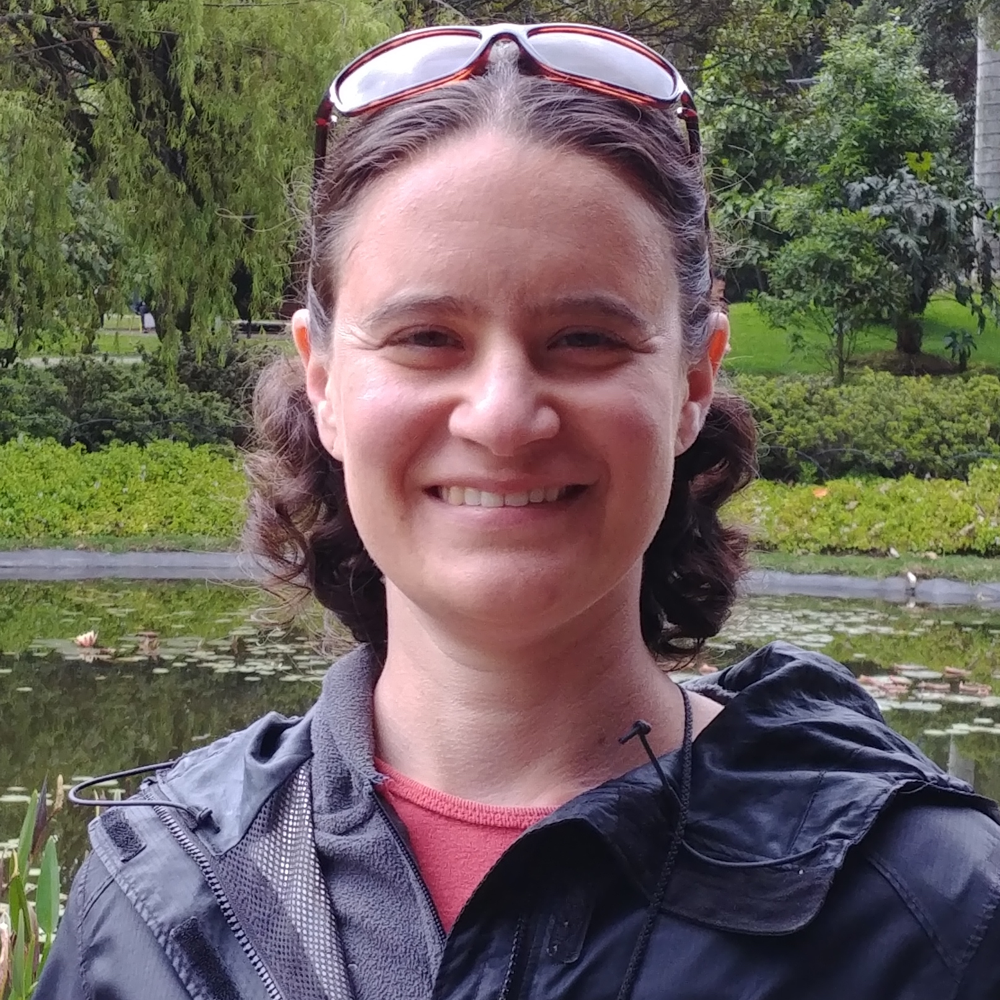

```{r setup, include=FALSE}
knitr::opts_chunk$set(echo = FALSE)
```

## PI



Rachel Schwartz is an Associate Professor at the University of Rhode Island. I run a dry lab focused on computational evolutionary genetics. My interest is in developing methods to understand evolution, with a particular focus on how we analyze large genomics datasets. I also have an interest in reproducible research and in teaching research skills to students and other researchers.

<i class="fa fa-github fa-lg"></i> [Github](https://github.com/rachelss)

<i class="fa fa-github fa-lg"></i> [Lab Github](https://github.com/schwartzlaburi)

<i class="fa fa-google fa-lg"></i> [Google Scholar](https://scholar.google.com/citations?user=z-xKqyIAAAAJ&hl=en)

<i class="fa fa-envelope-o fa-lg"></i> [Email](mailto:rsschwartz@uri.edu)

<i class="fa fa-twitter fa-lg"></i> [rachelss](https://twitter.com/rachelss)

<i class="fa fa-file fa-lg"></i>[CV]()

<br clear="all">

<hr>

## Postdoctoral Researchers


<br clear="all">
Alexandra Walling 

<hr>

## Graduate Students


Leann Biancani joined the lab in Fall 2021 as a PhD student in the BES program. Leann obtained her BS at Brown University and then continued at Brown as a Lab Manager and Research Assistant for David Rand. She then moved to the University of Maryland for her Masters. Before starting her PhD, Leann taught at the Wheeler School.

<hr>
## Undergraduates

Noah Waite

Madi Maiorano


<hr>
## Alumni

### Postdocs 

<br clear="all">

Alex Knyshov was a Postdoctoral Researcher working on examination of phylogenomic datasets using a variety of computational tools, including machine learning. He is currently a researchers in biomedical genetics at Boston University.

Dr. Tejashree Modak was a postdoctoral researcher in the lab who characterized copy number variation in the Eastern Oyster genome. She is currently a Senior Clinical Bioinformatics Scientist with [Pillar Biosciences](https://pillar-biosciences.com/).

Dr. Robert (Bob) Literman was an NSF Postdoctoral Fellow developing computational methods to identify and classify high-information and low-information subsets of phylogenomics data. He is currently an ORISE Fellow with the FDA.

<hr>

### Graduate Students

Eren Ada completed his Ph.D. in the Schwartz Lab. His dissertation focused on utilizing large-scale genomic data in phylogenetic analyses. He investigated how using  different genomic data affected phylogenetic estimates for birds. He is currently a Senior Bioinformatician at Harvard Medical School.

Yana Hrytseno was a PhD student in Computer Science working with Dr. Noah Daniels and in the Schwartz Lab. Yana's research interests include computational biology, population and cancer genomics. Her work is directed towards discovering broad-scale similarities between different types of cancer. She is currently a postdoctoral researcher at Harvard.

<hr>


Elise VanLuinen was an undergraduate researcher in summer 2023. She sequenced and assembled the genome of the 

Brianna Smith (URI '25) examined the phylogeny of lampreys. Her research is published in Molecular Phylogenetics and Evolution.

Robin Fidel (URI Biotechnology and Data Science '23) is researching copy number variation's contribution to the
addition of genes to a gene family, specifically the IFI44 and GIMAP gene families in oysters. 

Jewel Voyer (URI BIO and Neuroscience '22) used SISRS to examine relationships among the genus Ixodes, as well as the relationships between gene family evolution and song in birds. She is currently a research technician at Harvard Medical/Boston Children's Hospital.

Caleb Chapentier (SELU '22) is currently at PhD student at Virginia Tech.

Alyssa Hartmann (URI BIO '21) identified cellulose synthase genes across mosses to determine how this gene family arose. She is currently studying material science at the Fashion Institute.

Keyline Moreno (URI '21) is a Research Assistant at Women & Infants Hospital.

Caitlin Guccione (URI MS Applied Math '20 and CS '20) applied machine learning methods to SISRS output to categorize potentially misleading information in phylogenetic markers. She is currently a PhD student at UCSD in Bioinformatics.

Alexandra (Lexi) Johnson (URI BIO '20) worked on using SISRS to examine relationships among the genus Solanum. She is currently a graduate student at URI.

Fidaa Janoudi (URI ESM '20) worked in the lab as an undergraduate to develop a website for undergraduates to understand the research done at URI. She completed a Masters at URI and is now works in GIS.

Tiantian Gousie (URI BIO '20) was an undergraduate in the lab who used SISRS to examine how different datasets result in different phylogenies in birds. She is currently a Research Assistant at Salve Regina University.

Devin McConnell (URI CS '19) worked on updating and documenting SISRS code. He completed a MS in Computer Science at UConn before moving into the field of nursing.

Baizat Ibrahim (URI CMB '19) is currently a Senior Clinical Research Assistant at Women & Infants Hospital.

AY Akintomide (URI CMB '20) works at AmGen.

Nicholas Barone (URI Kinesiology '19) is currently a Medical Scribe.

Talia Santos (URI BIO '18)
